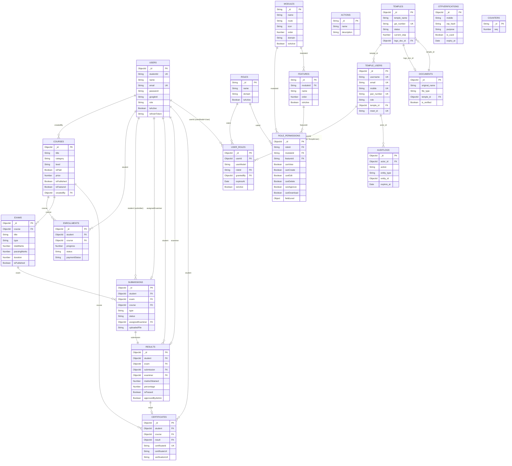

# Database Design — ISKCON Amritsar Course Portal (PIHEDelivery1)

> **Database:** MongoDB (Mongoose 7+)  
> **Connection URI:** `mongodb://localhost:27017/iskcon_pihe_amritsar`  
> **Generated:** 2026-04-18 | **RBAC Update:** 2026-04-18  
> **Scope:** LMS Module + Temple Registration Module + Enterprise RBAC

---

## Table of Contents

1. [Collection Inventory](#1-collection-inventory)
2. [LMS Domain — Collection Details](#2-lms-domain)
3. [RBAC Domain — Collection Details](#3-rbac-domain)
4. [Temple Registration Domain — Collection Details](#4-temple-registration-domain)
5. [ER Diagram (Mermaid)](#5-er-diagram)
6. [Indexing Strategy](#6-indexing-strategy)
7. [Sample Documents](#7-sample-documents)
8. [Design Patterns & Rationale](#8-design-patterns--rationale)
9. [Gap Analysis & Improvements](#9-gap-analysis--improvements)

---

## 1. Collection Inventory

| # | Collection | Mongoose Model | Domain | Purpose |
|---|-----------|---------------|--------|---------|
| 1 | `users` | `User` | LMS / Auth | Students, examiners, admins on the learning platform |
| 2 | `courses` | `Course` | LMS | Course catalog with embedded lessons and study materials |
| 3 | `enrollments` | `Enrollment` | LMS | Student–course enrollment records with progress tracking |
| 4 | `exams` | `Exam` | LMS / Examination | Exams linked to courses; embedded questions |
| 5 | `submissions` | `Submission` | LMS / Examination | Student exam answers — online (MCQ/text) and offline (PDF) |
| 6 | `results` | `Result` | LMS / Examination | Evaluated results with marks, pass/fail, admin approval gate |
| 7 | `certificates` | `Certificate` | LMS / Certification | Issued PDF certificates with public verification URL |
| 8 | `roles` | `Role` | **RBAC** | Named roles (`admin`, `examiner`, `student`, `PRESIDENT`, etc.) |
| 9 | `user_roles` | `UserRole` | **RBAC** | Junction: maps user → role (supports multi-role assignment) |
| 10 | `modules` | `Module` | **RBAC** | Menu items / screens (e.g., Temple Registration, Courses) |
| 11 | `features` | `Feature` | **RBAC** | UI sections within a module (e.g., President Details Section) |
| 12 | `actions` | `Action` | **RBAC** | System-level capabilities: CREATE, READ, UPDATE, DELETE, APPROVE, DOWNLOAD |
| 13 | `role_permissions` | `RolePermission` | **RBAC** | Core permission matrix: role → module → feature → permissions + field-level |
| 14 | `temples` | `Temple` | Temple Registration | Multi-step temple registration lifecycle document |
| 15 | `temple_users` | `TempleUser` | Temple Auth | Login accounts for temple President and Vice-President |
| 16 | `otpverifications` | `OtpVerification` | OTP / Auth | Time-limited OTP records for mobile verification |
| 17 | `auditlogs` | `AuditLog` | Compliance | Immutable event log with before/after diffs; 365-day TTL |
| 18 | `counters` | `Counter` | Utility | Atomic auto-increment sequences (meet_id, studentId) |
| 19 | `documents` | `Document` | File Management | File upload metadata (logos, photos, ID cards) |

---

## 2. LMS Domain

### 2.1 `users`

**Purpose:** Core identity store for students, examiners, and admins. The `role` field retains backward-compatibility; fine-grained access is governed by the RBAC `user_roles → role_permissions` chain.

| Field | Type | Required | Default | Description |
|-------|------|----------|---------|-------------|
| `_id` | ObjectId | Auto | — | MongoDB primary key |
| `studentId` | String | No | — | Auto-generated unique ID (format: `PIHE-YYYY-NNNN`); sparse unique |
| `name` | String | **Yes** | — | Full name; min 2, max 100 chars, trimmed |
| `email` | String | **Yes** | — | Unique, lowercase; primary login identifier |
| `password` | String | No | — | Bcrypt hash (12 rounds); `select: false`; absent for Google OAuth users |
| `googleId` | String | No | — | Google OAuth sub-ID; sparse unique; `select: false` |
| `role` | String | No | `student` | Legacy enum: `admin` \| `examiner` \| `student` — kept for backward compat; RBAC via `user_roles` |
| `avatar` | String | No | `null` | Profile picture URL |
| `phone` | String | No | — | Indian mobile `/^[6-9]\d{9}$/` |
| `isActive` | Boolean | No | `true` | Soft-delete / account suspension flag |
| `refreshToken` | String | No | — | Stored JWT refresh token; `select: false` |
| `createdAt` | Date | Auto | — | Mongoose timestamps |
| `updatedAt` | Date | Auto | — | Mongoose timestamps |

**Indexes:** `email` (unique), `studentId` (unique, sparse), `role`

---

### 2.2 `courses`

**Purpose:** Course catalog. Lessons and study materials are **embedded** for read performance.

| Field | Type | Required | Default | Description |
|-------|------|----------|---------|-------------|
| `_id` | ObjectId | Auto | — | Primary key |
| `title` | String | **Yes** | — | Course title; max 200 chars |
| `description` | String | **Yes** | — | Course description; max 2000 chars |
| `thumbnail` | String | No | `null` | Thumbnail image URL |
| `category` | String | **Yes** | — | Category string (e.g., "Scriptures", "Mathematics") |
| `level` | String | **Yes** | — | Enum: `Beginner` \| `Intermediate` \| `Advanced` |
| `isPaid` | Boolean | No | `false` | Paid vs free course |
| `price` | Number | No | `0` | Price in INR; min 0 |
| `lessons` | [lessonSchema] | No | `[]` | **Embedded** lessons array |
| `studyMaterials` | [studyMaterialSchema] | No | `[]` | **Embedded** downloadable materials |
| `tags` | [String] | No | `[]` | Searchable keyword tags |
| `isPublished` | Boolean | No | `false` | Visibility to students |
| `isFeatured` | Boolean | No | `false` | Homepage featured section |
| `isBestSeller` | Boolean | No | `false` | Best-seller badge |
| `isPopular` | Boolean | No | `false` | Popular badge |
| `createdBy` | ObjectId (ref User) | **Yes** | — | Admin who created the course |
| `createdAt` | Date | Auto | — | — |
| `updatedAt` | Date | Auto | — | — |

**Embedded: `lessons[]`**

| Field | Type | Required | Description |
|-------|------|----------|-------------|
| `title` | String | **Yes** | Lesson title |
| `content` | String | No | Text/HTML content |
| `videoUrl` | String | No | Video stream URL |
| `duration` | Number | No | Duration in minutes; default 0 |
| `order` | Number | **Yes** | Sort order within course |
| `isPublished` | Boolean | No | Per-lesson visibility; default `true` |

**Embedded: `studyMaterials[]`**

| Field | Type | Required | Description |
|-------|------|----------|-------------|
| `title` | String | **Yes** | Material display name |
| `fileUrl` | String | **Yes** | Download URL |
| `fileType` | String | No | Default `pdf` |
| `fileSize` | Number | No | File size in bytes |

**Virtual:** `lessonCount` — computed count of `lessons` array

**Indexes:** `isPublished + category` (compound), `tags`, `isFeatured`, `createdAt` (DESC)

---

### 2.3 `enrollments`

**Purpose:** Student–course binding. Tracks lesson progress and payment.

| Field | Type | Required | Default | Description |
|-------|------|----------|---------|-------------|
| `_id` | ObjectId | Auto | — | Primary key |
| `student` | ObjectId (ref User) | **Yes** | — | Enrolled student |
| `course` | ObjectId (ref Course) | **Yes** | — | Target course |
| `enrolledAt` | Date | No | `Date.now` | Enrollment timestamp |
| `progress` | Number | No | `0` | Completion % (0–100); auto-recalculated |
| `completedLessons` | [ObjectId] | No | `[]` | Array of completed lesson `_id`s |
| `status` | String | No | `active` | Enum: `active` \| `completed` \| `dropped` |
| `paymentStatus` | String | No | `free` | Enum: `free` \| `paid` \| `pending` |
| `createdAt` | Date | Auto | — | — |
| `updatedAt` | Date | Auto | — | — |

**Indexes:** `student + course` (unique compound — prevents duplicate enrollment), `student`, `status`

---

### 2.4 `exams`

**Purpose:** Exam definitions. Questions are **embedded** sub-documents.

| Field | Type | Required | Default | Description |
|-------|------|----------|---------|-------------|
| `_id` | ObjectId | Auto | — | Primary key |
| `course` | ObjectId (ref Course) | **Yes** | — | Parent course |
| `title` | String | **Yes** | — | Exam title |
| `description` | String | No | `''` | Optional description |
| `type` | String | **Yes** | — | Enum: `online` \| `offline` |
| `questions` | [questionSchema] | No | `[]` | **Embedded** questions array |
| `totalMarks` | Number | **Yes** | — | Maximum possible marks |
| `passingMarks` | Number | **Yes** | — | Minimum marks to pass |
| `duration` | Number | **Yes** | — | Duration in minutes |
| `isPublished` | Boolean | No | `false` | Visibility to students |
| `createdAt` | Date | Auto | — | — |
| `updatedAt` | Date | Auto | — | — |

**Embedded: `questions[]`**

| Field | Type | Required | Description |
|-------|------|----------|-------------|
| `questionText` | String | **Yes** | Question text |
| `type` | String | No | Enum: `mcq` \| `short` \| `long`; default `mcq` |
| `options` | [String] | No | MCQ choices array (4 options) |
| `correctAnswer` | String | No | Correct MCQ answer — **NEVER sent to students** |
| `marks` | Number | **Yes** | Marks for this question; min 0 |
| `order` | Number | No | Display order; default 0 |

**Indexes:** `course`, `isPublished`

---

### 2.5 `submissions`

**Purpose:** Student exam attempts — online answers or offline PDF upload.

| Field | Type | Required | Default | Description |
|-------|------|----------|---------|-------------|
| `_id` | ObjectId | Auto | — | Primary key |
| `student` | ObjectId (ref User) | **Yes** | — | Submitting student |
| `exam` | ObjectId (ref Exam) | **Yes** | — | Target exam |
| `course` | ObjectId (ref Course) | **Yes** | — | Parent course (denormalised for fast queries) |
| `type` | String | **Yes** | — | Enum: `online` \| `offline` |
| `answers` | [answerSchema] | No | `[]` | **Embedded** answers for online exams |
| `uploadedFile` | String | No | `null` | File path for offline PDF submission |
| `submittedAt` | Date | No | `Date.now` | Submission timestamp |
| `status` | String | No | `pending` | Enum: `pending` \| `evaluated` \| `approved` |
| `assignedExaminer` | ObjectId (ref User) | No | `null` | Examiner assigned for manual evaluation |
| `createdAt` | Date | Auto | — | — |
| `updatedAt` | Date | Auto | — | — |

**Embedded: `answers[]`**

| Field | Type | Required | Description |
|-------|------|----------|-------------|
| `questionId` | ObjectId | **Yes** | Reference to embedded question `_id` in exam |
| `selectedOption` | String | No | Chosen MCQ option text |
| `answerText` | String | No | Free-text answer for short/long questions |

**Indexes:** `student + exam` (compound), `status`, `assignedExaminer + status` (compound)

---

### 2.6 `results`

**Purpose:** Evaluated exam results. Admin approval gate before certificate generation.

| Field | Type | Required | Default | Description |
|-------|------|----------|---------|-------------|
| `_id` | ObjectId | Auto | — | Primary key |
| `student` | ObjectId (ref User) | **Yes** | — | Evaluated student |
| `exam` | ObjectId (ref Exam) | **Yes** | — | Evaluated exam |
| `submission` | ObjectId (ref Submission) | **Yes** | — | Source submission |
| `examiner` | ObjectId (ref User) | No | `null` | Evaluating examiner; `null` for auto-graded |
| `marksObtained` | Number | **Yes** | — | Raw score; min 0 |
| `totalMarks` | Number | **Yes** | — | Max marks (denormalised from exam) |
| `percentage` | Number | No | — | **Auto-calculated** via pre-save hook: `(marksObtained/totalMarks)*100` |
| `remarks` | String | No | `''` | Examiner feedback (visible to student) |
| `isPassed` | Boolean | **Yes** | — | Pass/fail determination |
| `evaluatedAt` | Date | No | `Date.now` | Evaluation timestamp |
| `approvedByAdmin` | Boolean | No | `false` | Admin approval gate before certificate generation |
| `approvedAt` | Date | No | `null` | Admin approval timestamp |
| `createdAt` | Date | Auto | — | — |
| `updatedAt` | Date | Auto | — | — |

**Indexes:** `student`, `approvedByAdmin`

---

### 2.7 `certificates`

**Purpose:** Issued course completion certificates. PDFKit-generated files.

| Field | Type | Required | Default | Description |
|-------|------|----------|---------|-------------|
| `_id` | ObjectId | Auto | — | Primary key |
| `student` | ObjectId (ref User) | **Yes** | — | Certificate recipient |
| `course` | ObjectId (ref Course) | **Yes** | — | Completed course |
| `result` | ObjectId (ref Result) | **Yes** | — | Backing approved result |
| `certificateId` | String | **Yes** | — | Globally unique ID (format: `CERT-YYYY-XXXXXXXX`); unique index |
| `issuedAt` | Date | No | `Date.now` | Certificate issue date |
| `certificateUrl` | String | **Yes** | — | Server filesystem or CDN path to PDF |
| `verificationUrl` | String | **Yes** | — | Public URL for third-party verification |
| `createdAt` | Date | Auto | — | — |
| `updatedAt` | Date | Auto | — | — |

**Indexes:** `certificateId` (unique), `student`

---

## 3. RBAC Domain

> **Design Philosophy:** The RBAC system is a 5-layer hierarchy: `users → user_roles → roles → role_permissions → (modules × features × actions)`. This enables module-level access control, feature-level UI gating, action-based authorization, and field-level security — all driven from the database with no hardcoded role logic in application code.

---

### 3.1 `roles`

**Purpose:** Named role definitions. Covers both LMS roles (`admin`, `examiner`, `student`) and Temple roles (`PRESIDENT`, `VICE_PRESIDENT`, `SUPER_ADMIN`). Replaces the hardcoded `users.role` enum as the authoritative source.

| Field | Type | Required | Default | Description |
|-------|------|----------|---------|-------------|
| `_id` | String | **Yes** | — | Human-readable slug (e.g., `"admin"`, `"PRESIDENT"`); used as FK in `user_roles` and `role_permissions` |
| `name` | String | **Yes** | — | Display name (e.g., `"Administrator"`, `"Temple President"`) |
| `domain` | String | **Yes** | — | Enum: `LMS` \| `TEMPLE` \| `SYSTEM` — scopes role to its context |
| `description` | String | No | `''` | Human-readable role description |
| `isActive` | Boolean | No | `true` | Soft-disable a role system-wide |
| `createdAt` | Date | Auto | — | — |

**Seed Data:**

| `_id` | `name` | `domain` |
|-------|--------|---------|
| `admin` | Administrator | LMS |
| `examiner` | Examiner | LMS |
| `student` | Student | LMS |
| `PRESIDENT` | Temple President | TEMPLE |
| `VICE_PRESIDENT` | Temple Vice President | TEMPLE |
| `SUPER_ADMIN` | Super Administrator | SYSTEM |

**Indexes:** `domain`, `isActive`

---

### 3.2 `user_roles`

**Purpose:** Junction collection binding users (LMS or Temple) to one or more roles. Supports multi-role assignment and time-bound role grants.

| Field | Type | Required | Default | Description |
|-------|------|----------|---------|-------------|
| `_id` | ObjectId | Auto | — | Primary key |
| `userId` | ObjectId | **Yes** | — | Ref to `users._id` OR `temple_users._id` (polymorphic) |
| `userModel` | String | **Yes** | — | Enum: `User` \| `TempleUser` — discriminator for polymorphic ref |
| `roleId` | String | **Yes** | — | Ref to `roles._id` (e.g., `"admin"`, `"PRESIDENT"`) |
| `grantedBy` | ObjectId | No | `null` | Admin who granted this role |
| `grantedAt` | Date | No | `Date.now` | Role assignment timestamp |
| `expiresAt` | Date | No | `null` | Optional role expiry (null = permanent) |
| `isActive` | Boolean | No | `true` | Revoke without deleting |
| `createdAt` | Date | Auto | — | — |

**Indexes:** `userId + roleId` (unique compound — prevents duplicate assignment), `userId + isActive` (compound), `roleId`, `expiresAt` (sparse — TTL candidate for time-bound roles)

---

### 3.3 `modules`

**Purpose:** Defines all navigable screens/menus in the application. Used by the frontend to dynamically render the sidebar and guard route access.

| Field | Type | Required | Default | Description |
|-------|------|----------|---------|-------------|
| `_id` | String | **Yes** | — | Human-readable slug (e.g., `"temple-registration"`, `"courses"`) |
| `name` | String | **Yes** | — | Display name (e.g., `"Temple Registration"`, `"Course Management"`) |
| `route` | String | **Yes** | — | Frontend route path (e.g., `"/temple-registration"`, `"/admin/courses"`) |
| `icon` | String | No | `null` | Lucide icon name string (e.g., `"temple"`, `"book-open"`) |
| `order` | Number | No | `999` | Sidebar sort order |
| `parentModule` | String | No | `null` | Parent module `_id` for nested navigation |
| `domain` | String | **Yes** | — | Enum: `LMS` \| `TEMPLE` \| `SYSTEM` — scopes module to context |
| `isActive` | Boolean | No | `true` | Hide module globally without deleting |
| `createdAt` | Date | Auto | — | — |

**Seed Data:**

| `_id` | `name` | `route` | `domain` | `order` |
|-------|--------|---------|---------|---------|
| `dashboard-admin` | Admin Dashboard | `/admin/dashboard` | LMS | 1 |
| `courses` | Course Management | `/admin/courses` | LMS | 2 |
| `students` | Student Management | `/admin/students` | LMS | 3 |
| `exams` | Exam Management | `/admin/exams` | LMS | 4 |
| `examiners` | Examiner Management | `/admin/examiners` | LMS | 5 |
| `certificates` | Certificate Management | `/admin/certificates` | LMS | 6 |
| `reports` | Reports | `/admin/reports` | LMS | 7 |
| `temple-registration` | Temple Registration | `/temple-registration` | TEMPLE | 1 |
| `student-dashboard` | Student Dashboard | `/student/dashboard` | LMS | 1 |
| `my-courses` | My Courses | `/student/courses` | LMS | 2 |
| `examiner-dashboard` | Examiner Dashboard | `/examiner/dashboard` | LMS | 1 |

**Indexes:** `domain`, `order`, `isActive`

---

### 3.4 `features`

**Purpose:** Defines granular UI sections within a module. Enables feature-level access gating (show/hide entire form sections, table columns, or sub-pages based on role).

| Field | Type | Required | Default | Description |
|-------|------|----------|---------|-------------|
| `_id` | String | **Yes** | — | Human-readable slug (e.g., `"president-details"`, `"exam-questions"`) |
| `moduleId` | String | **Yes** | — | Ref to `modules._id` |
| `name` | String | **Yes** | — | Display name (e.g., `"President Details Section"`, `"Question Builder"`) |
| `description` | String | No | `''` | What this feature controls |
| `order` | Number | No | `999` | Display order within module |
| `isActive` | Boolean | No | `true` | Disable feature system-wide |
| `createdAt` | Date | Auto | — | — |

**Sample Seed Data:**

| `_id` | `moduleId` | `name` |
|-------|-----------|--------|
| `president-details` | `temple-registration` | President Details Section |
| `vice-president-details` | `temple-registration` | Vice President Details Section |
| `temple-details` | `temple-registration` | Temple Details Section |
| `review-submit` | `temple-registration` | Review & Submit Section |
| `lesson-builder` | `courses` | Lesson Builder |
| `study-materials` | `courses` | Study Materials Upload |
| `exam-questions` | `exams` | Question Builder |
| `result-approval` | `certificates` | Result Approval |
| `per-question-marks` | `exams` | Per-Question Marks Input |

**Indexes:** `moduleId`, `isActive`

---

### 3.5 `actions`

**Purpose:** System-level capability definitions. Used as named permission gates in `role_permissions.permissions` and checked by the RBAC middleware on every API call.

| Field | Type | Required | Description |
|-------|------|----------|-------------|
| `_id` | String | **Yes** | Action slug — enum: `CREATE` \| `READ` \| `UPDATE` \| `DELETE` \| `APPROVE` \| `DOWNLOAD` |
| `name` | String | **Yes** | Human label (e.g., `"Create Record"`, `"Download Certificate"`) |
| `description` | String | No | What triggering this action means |

**Complete Seed Data:**

| `_id` | `name` | Description |
|-------|--------|-------------|
| `CREATE` | Create | Create new records |
| `READ` | Read / View | View data, load pages, fetch API responses |
| `UPDATE` | Update / Edit | Modify existing records |
| `DELETE` | Delete | Remove records (hard or soft delete) |
| `APPROVE` | Approve | Approve results, registrations, or submissions |
| `DOWNLOAD` | Download | Download certificates, exports, PDFs |

---

### 3.6 `role_permissions` 🔥

**Purpose:** Core of the RBAC system. Each document grants a specific role access to a module × feature combination, with granular boolean permission flags AND optional field-level access rules. This single collection drives API middleware authorization, frontend UI visibility, and field editability.

| Field | Type | Required | Default | Description |
|-------|------|----------|---------|-------------|
| `_id` | ObjectId | Auto | — | Primary key |
| `roleId` | String | **Yes** | — | Ref to `roles._id` (e.g., `"admin"`, `"PRESIDENT"`) |
| `moduleId` | String | **Yes** | — | Ref to `modules._id` (e.g., `"temple-registration"`) |
| `featureId` | String | No | `null` | Ref to `features._id`; `null` = module-level grant (applies to all features) |
| `permissions` | permissionsSchema | **Yes** | — | Boolean flags for each action |
| `fieldLevel` | Object | No | `{}` | Map of fieldName → access level for field-level security |
| `createdAt` | Date | Auto | — | — |
| `updatedAt` | Date | Auto | — | — |

**Embedded: `permissions` (sub-document)**

| Field | Type | Default | Description |
|-------|------|---------|-------------|
| `canView` | Boolean | `false` | Can user see this module/feature at all? (READ gate) |
| `canCreate` | Boolean | `false` | Can user create records in this module/feature? |
| `canEdit` | Boolean | `false` | Can user edit existing records? |
| `canDelete` | Boolean | `false` | Can user delete records? |
| `canApprove` | Boolean | `false` | Can user approve records (results, registrations)? |
| `canDownload` | Boolean | `false` | Can user download files/PDFs? |

**Embedded: `fieldLevel` (dynamic map)**

Field-level access rules are a key-value map where:
- **Key:** Database/form field name (e.g., `"email"`, `"mobile"`, `"govtId"`, `"pan_number"`)
- **Value:** Enum string — one of `READ_ONLY` \| `EDITABLE` \| `HIDDEN`

| Value | Meaning | Frontend Behavior |
|-------|---------|------------------|
| `READ_ONLY` | User can see but not modify | Render as `<span>` or `disabled` input |
| `EDITABLE` | User can see and modify | Render as normal `<input>` |
| `HIDDEN` | User cannot see at all | Completely exclude from render |

**Indexes:** `roleId + moduleId + featureId` (unique compound — one permission doc per role/module/feature triple), `roleId`, `moduleId`

**Sample Role Permission Documents:**

```json
// PRESIDENT can view & create temple registration, but not approve
{
  "_id": "rp1",
  "roleId": "PRESIDENT",
  "moduleId": "temple-registration",
  "featureId": "president-details",
  "permissions": {
    "canView": true,
    "canCreate": true,
    "canEdit": true,
    "canDelete": false,
    "canApprove": false,
    "canDownload": false
  },
  "fieldLevel": {
    "email": "READ_ONLY",
    "mobile": "EDITABLE",
    "pan_number": "READ_ONLY",
    "aadhaar_number": "HIDDEN"
  }
}

// ADMIN has full access to courses module
{
  "_id": "rp2",
  "roleId": "admin",
  "moduleId": "courses",
  "featureId": null,
  "permissions": {
    "canView": true,
    "canCreate": true,
    "canEdit": true,
    "canDelete": true,
    "canApprove": true,
    "canDownload": true
  },
  "fieldLevel": {}
}

// STUDENT can only view courses, cannot create or edit
{
  "_id": "rp3",
  "roleId": "student",
  "moduleId": "courses",
  "featureId": null,
  "permissions": {
    "canView": true,
    "canCreate": false,
    "canEdit": false,
    "canDelete": false,
    "canApprove": false,
    "canDownload": true
  },
  "fieldLevel": {}
}

// EXAMINER on per-question-marks feature
{
  "_id": "rp4",
  "roleId": "examiner",
  "moduleId": "exams",
  "featureId": "per-question-marks",
  "permissions": {
    "canView": true,
    "canCreate": false,
    "canEdit": true,
    "canDelete": false,
    "canApprove": false,
    "canDownload": false
  },
  "fieldLevel": {
    "totalMarks": "READ_ONLY",
    "passingMarks": "READ_ONLY"
  }
}
```

---

## 4. Temple Registration Domain

### 4.1 `temples`

**Purpose:** Multi-step temple registration document. Lifecycle: `DRAFT → SUBMITTED → UNDER_REVIEW → APPROVED/REJECTED`.

| Field | Type | Required | Default | Description |
|-------|------|----------|---------|-------------|
| `_id` | ObjectId | Auto | — | Primary key |
| `temple_name` | String | **Yes** | — | Temple display name; indexed |
| `gst_number` | String | **Yes** | — | Valid 15-char GST; unique, uppercase |
| `address` | addressSchema | **Yes** | — | Embedded address sub-document |
| `logo_doc_id` | ObjectId (ref Document) | No | `null` | Temple logo file reference |
| `president` | personSchema | No | `null` | President details (embedded) |
| `vice_president` | personSchema | No | `null` | VP details (same schema as president) |
| `status` | String | No | `DRAFT` | Enum: `DRAFT` \| `SUBMITTED` \| `UNDER_REVIEW` \| `APPROVED` \| `REJECTED` |
| `current_step` | Number | No | `1` | Multi-step progress tracker (1–5) |
| `rejection_reason` | String | No | `null` | Admin rejection note |
| `reviewed_by` | ObjectId (ref TempleUser) | No | `null` | Reviewing admin |
| `reviewed_at` | Date | No | `null` | Review timestamp |
| `submitted_at` | Date | No | `null` | Final submission timestamp |
| `ip_address` | String | No | `null` | Submitter IP for audit |
| `createdAt` | Date | Auto | — | — |
| `updatedAt` | Date | Auto | — | — |

**Embedded address schema:** `line1`, `line2`, `city`, `state`, `country`, `pin_code` (all required except `line2`)

**Embedded personSchema (president/vice_president):** `name`, `mobile`, `mobile_verified`, `pan_number`, `aadhaar_number`, `email`, `photo_doc_id`, `id_card_doc_id`, `user_id`, `meet_id`

**Indexes:** `gst_number` (unique), `president.pan_number` (unique, sparse), `vice_president.pan_number` (unique, sparse), `president.mobile` (unique, sparse), `vice_president.mobile` (unique, sparse), `president.email` (unique, sparse), `vice_president.email` (unique, sparse), `status + createdAt DESC` (compound)

---

### 4.2 `temple_users`

**Purpose:** Authentication store for temple Presidents and Vice-Presidents (separate from LMS `users`). Integrated with RBAC via `user_roles` where `userModel = "TempleUser"`.

| Field | Type | Required | Default | Description |
|-------|------|----------|---------|-------------|
| `_id` | ObjectId | Auto | — | Primary key |
| `username` | String | **Yes** | — | Unique login handle (firstName + last4 of mobile) |
| `password_hash` | String | **Yes** | — | Bcrypt hash (12 rounds); `select: false` |
| `name` | String | **Yes** | — | Full display name |
| `email` | String | **Yes** | — | Unique Gmail address |
| `mobile` | String | **Yes** | — | Unique 10-digit mobile |
| `pan_number` | String | **Yes** | — | Unique PAN card; uppercase |
| `role` | String | **Yes** | — | Legacy enum: `PRESIDENT` \| `VICE_PRESIDENT` \| `ADMIN` \| `SUPER_ADMIN` — kept for compatibility; RBAC via `user_roles` |
| `temple_id` | ObjectId (ref Temple) | **Yes** | — | Associated temple |
| `meet_id` | String | No | — | Unique Google Meet-style ID; sparse |
| `is_active` | Boolean | No | `true` | Soft-delete flag |
| `last_login_at` | Date | No | `null` | Last successful login |
| `login_attempts` | Number | No | `0` | Failed login counter (brute-force protection) |
| `locked_until` | Date | No | `null` | Account lockout expiry |
| `createdAt` | Date | Auto | — | — |
| `updatedAt` | Date | Auto | — | — |

**Indexes:** `username` (unique), `email` (unique), `mobile` (unique), `pan_number` (unique), `meet_id` (unique, sparse), `temple_id + role` (compound)

---

### 4.3 `otpverifications`

**Purpose:** Time-limited OTP records for mobile verification. TTL auto-deletes expired docs.

| Field | Type | Required | Default | Description |
|-------|------|----------|---------|-------------|
| `_id` | ObjectId | Auto | — | Primary key |
| `mobile` | String | **Yes** | — | Target mobile number |
| `otp_hash` | String | **Yes** | — | Bcrypt hash of OTP; `select: false` |
| `purpose` | String | No | `REGISTRATION` | Enum: `REGISTRATION` \| `LOGIN` \| `RESET` |
| `is_used` | Boolean | No | `false` | One-time-use flag |
| `attempts` | Number | No | `0` | Wrong attempt counter; max 3 |
| `expiry_at` | Date | **Yes** | — | **TTL index** — auto-deleted at this time (~10 min) |
| `ip_address` | String | No | `null` | Sender IP for abuse tracking |
| `createdAt` | Date | Auto | — | — |

**Indexes:** `mobile`, `mobile + purpose + is_used` (compound), `expiry_at` (TTL)

---

### 4.4 `auditlogs`

**Purpose:** Immutable write-once event log. 365-day TTL auto-purge.

| Field | Type | Required | Default | Description |
|-------|------|----------|---------|-------------|
| `_id` | ObjectId | Auto | — | Primary key |
| `actor_id` | ObjectId (ref TempleUser) | No | `null` | User who acted; `null` for SYSTEM |
| `actor_type` | String | No | `SYSTEM` | Enum: `USER` \| `SYSTEM` \| `ADMIN` |
| `action` | String | **Yes** | — | Event name (e.g. `TEMPLE_SUBMITTED`, `OTP_SENT`, `ROLE_ASSIGNED`) |
| `entity_type` | String | **Yes** | — | Target collection name (e.g. `Temple`, `UserRole`) |
| `entity_id` | ObjectId | **Yes** | — | Target document `_id` (polymorphic) |
| `diff.before` | Mixed | No | `null` | Document state before change |
| `diff.after` | Mixed | No | `null` | Document state after change |
| `ip_address` | String | No | `null` | Request IP |
| `expires_at` | Date | No | +365 days | **TTL index** — auto-deleted after 1 year |
| `createdAt` | Date | Auto | — | — |

**Indexes:** `actor_id`, `entity_id`, `entity_type + entity_id + createdAt DESC`, `action + createdAt DESC`, `expires_at` (TTL)

---

### 4.5 `counters`

**Purpose:** Atomic auto-increment sequences.

| Field | Type | Required | Description |
|-------|------|----------|-------------|
| `_id` | String | **Yes** | Sequence key (e.g., `"meet_id"`, `"student_id"`) |
| `seq` | Number | No | Current value; incremented atomically via `$inc` |

---

### 4.6 `documents`

**Purpose:** File upload metadata for Temple Registration module.

| Field | Type | Required | Default | Description |
|-------|------|----------|---------|-------------|
| `_id` | ObjectId | Auto | — | Primary key |
| `original_name` | String | **Yes** | — | Original client filename |
| `stored_name` | String | **Yes** | — | Server-assigned UUID filename |
| `file_path` | String | **Yes** | — | Server path or S3 key |
| `file_url` | String | No | `null` | Public CDN/S3 URL |
| `mime_type` | String | **Yes** | — | MIME type |
| `size_bytes` | Number | **Yes** | — | File size in bytes |
| `file_type` | String | **Yes** | — | Enum: `logo` \| `photo` \| `id_card` |
| `temple_id` | ObjectId (ref Temple) | No | `null` | Owning temple (set post-registration) |
| `is_verified` | Boolean | No | `false` | Admin verification status |
| `createdAt` | Date | Auto | — | — |

**Indexes:** `temple_id`, `file_type + temple_id` (compound)

---

## 5. ER Diagram



---

## 6. Indexing Strategy

### Performance-Critical Indexes

| Collection | Index | Type | Cardinality | Use Case |
|-----------|-------|------|-------------|---------|
| `users` | `email` | Unique | High | Login lookup |
| `users` | `studentId` | Unique, Sparse | High | Profile/search |
| `users` | `role` | Regular | Low | Role-based filters |
| `enrollments` | `student + course` | Unique Compound | Very High | Prevent duplicate enrollment |
| `enrollments` | `student` | Regular | High | My courses queries |
| `submissions` | `assignedExaminer + status` | Compound | High | Examiner workload queries |
| `certificates` | `certificateId` | Unique | High | Verification endpoint |
| `temples` | `gst_number` | Unique | High | Duplicate GST prevention |
| `temples` | `president.pan_number` | Unique, Sparse | High | PAN uniqueness |
| `otpverifications` | `mobile + purpose + is_used` | Compound | High | Active OTP lookup |
| `otpverifications` | `expiry_at` | TTL | — | Auto-expiry |
| `auditlogs` | `expires_at` | TTL | — | Auto-purge after 365 days |
| **`user_roles`** | **`userId + roleId`** | **Unique Compound** | **High** | **Permission resolution** |
| **`user_roles`** | **`userId + isActive`** | **Compound** | **High** | **Active role fetch** |
| **`role_permissions`** | **`roleId + moduleId + featureId`** | **Unique Compound** | **High** | **RBAC middleware lookup** |
| **`role_permissions`** | **`roleId`** | **Regular** | **Low** | **Load all permissions for a role** |
| **`modules`** | **`domain + isActive`** | **Compound** | **Low** | **Dynamic sidebar rendering** |
| **`features`** | **`moduleId`** | **Regular** | **Medium** | **Feature-level gating** |

### Sparse Index Usage

Sparse indexes are used on fields that are optional but must be unique when present:
`googleId`, `studentId`, `meet_id`, `president.pan_number`, `vice_president.pan_number`, `president.mobile`, `vice_president.mobile`, `president.email`, `vice_president.email`, `user_roles.expiresAt`.

---

## 7. Sample Documents

### User (Student)
```json
{
  "_id": "664a1f2e3b9c4d0012ab3456",
  "studentId": "PIHE-2026-0042",
  "name": "Priya Sharma",
  "email": "priya.sharma@example.com",
  "role": "student",
  "avatar": "https://cdn.example.com/avatars/priya.jpg",
  "phone": "9876543210",
  "isActive": true,
  "createdAt": "2026-01-18T09:30:00.000Z"
}
```

### UserRole (Student assigned to 'student' role)
```json
{
  "_id": "665a1f2e3b9c4d0012ab9999",
  "userId": "664a1f2e3b9c4d0012ab3456",
  "userModel": "User",
  "roleId": "student",
  "grantedBy": null,
  "grantedAt": "2026-01-18T09:30:00.000Z",
  "expiresAt": null,
  "isActive": true
}
```

### RolePermission (PRESIDENT on temple-registration/president-details)
```json
{
  "_id": "666b2c3d4e5f6a0034cd5678",
  "roleId": "PRESIDENT",
  "moduleId": "temple-registration",
  "featureId": "president-details",
  "permissions": {
    "canView": true,
    "canCreate": true,
    "canEdit": true,
    "canDelete": false,
    "canApprove": false,
    "canDownload": false
  },
  "fieldLevel": {
    "email": "READ_ONLY",
    "mobile": "EDITABLE",
    "pan_number": "READ_ONLY",
    "aadhaar_number": "HIDDEN"
  }
}
```

### Course (with embedded lessons)
```json
{
  "_id": "664b2a3f1c0e5d0023bc4567",
  "title": "Introduction to Bhagavad Gita",
  "category": "Scriptures",
  "level": "Beginner",
  "isPaid": false,
  "price": 0,
  "lessons": [
    { "title": "Chapter 1: Arjuna's Dilemma", "videoUrl": "...", "duration": 45, "order": 1, "isPublished": true }
  ],
  "studyMaterials": [
    { "title": "Gita Chapter 1 PDF", "fileUrl": "...", "fileType": "pdf", "fileSize": 204800 }
  ],
  "isPublished": true,
  "isFeatured": true,
  "createdBy": "admin_id_here"
}
```

### Submission (Online)
```json
{
  "_id": "664e5d6i4f3h8g0056ef7890",
  "student": "664a1f2e3b9c4d0012ab3456",
  "exam": "664d4c5h3e2g7f0045de6789",
  "course": "664b2a3f1c0e5d0023bc4567",
  "type": "online",
  "answers": [
    { "questionId": "664d...", "selectedOption": "Sanjaya", "answerText": null }
  ],
  "status": "pending",
  "assignedExaminer": null,
  "submittedAt": "2026-04-10T10:45:00.000Z"
}
```

### Certificate
```json
{
  "_id": "665g7f8k6h5j0i0078gh9012",
  "student": "664a1f2e3b9c4d0012ab3456",
  "course": "664b2a3f1c0e5d0023bc4567",
  "result": "664f6e7j5g4i9h0067fg8901",
  "certificateId": "CERT-2026-A1B2C3D4",
  "issuedAt": "2026-04-15T10:00:00.000Z",
  "certificateUrl": "./generated-certs/CERT-2026-A1B2C3D4.pdf",
  "verificationUrl": "http://localhost:5173/verify/CERT-2026-A1B2C3D4"
}
```

---

## 8. Design Patterns & Rationale

**Embedding vs Referencing:** Lessons, study materials, questions, and answers are embedded within their parent documents (courses, exams, submissions) for read performance. Large, independently-queried entities (users, results, certificates) are referenced via ObjectId.

**Dual User Models:** `users` (LMS) and `temple_users` (Temple Registration) are intentionally separate collections to prevent schema conflicts and ensure clean domain isolation. Both integrate into RBAC via the polymorphic `user_roles` junction (`userModel` discriminator field).

**Pre-save Hooks:** `results.percentage` and `users.password` are computed/hashed in Mongoose pre-save hooks, ensuring integrity regardless of update path.

**Denormalisation:** `submissions.course` is denormalised from the exam for fast query without a double-populate. `results.totalMarks` is denormalised from the exam for historical accuracy even if the exam is later changed.

**Audit Trail:** All temple mutations write an immutable `AuditLog` with before/after diffs via structured event patterns. RBAC role assignments also emit `ROLE_ASSIGNED` / `ROLE_REVOKED` audit events.

**Security:** Sensitive fields (`password`, `password_hash`, `refreshToken`, `googleId`, `otp_hash`) are marked `select: false` system-wide.

**RBAC Permission Resolution:** The permission resolution chain is:
```
userId → user_roles (where isActive=true, expiresAt>now) 
       → roleId 
       → role_permissions (where roleId matches, moduleId matches, featureId matches or null) 
       → permissions + fieldLevel
```
Module-level grants (`featureId: null`) act as wildcards — if a more specific feature-level grant exists, it takes precedence (most-specific-wins strategy).

**Field-Level Security:** `role_permissions.fieldLevel` is a dynamic map (not a fixed schema) so new fields can be added to forms without schema migrations. The API middleware strips `HIDDEN` fields before serialising responses; the frontend uses the same permission map to render `READ_ONLY` fields as disabled inputs.

---

## 9. Gap Analysis & Improvements

### Identified Gaps (Updated)

| Issue | Severity | Status | Recommendation |
|-------|----------|--------|---------------|
| `courses.createdBy` should use `ref: 'User'` with correct populate | Medium | Open | Verify Mongoose ref is set correctly |
| No soft-delete on `courses` collection — hard deletes orphan enrollments/exams | High | Open | Add `isDeleted: Boolean` flag; use query middleware to filter |
| `submissions.uploadedFile` stores filesystem path — breaks at scale/cloud | High | Open | Integrate S3 presigned URLs; store S3 key instead of local path |
| No payment/order collection for paid courses | Medium | Open | Add `payments` collection linked to `enrollments` |
| `results` has no `perQuestionMarks` field but examiner frontend sends per-question data | High | Open | Add `perQuestionMarks: [{ questionId, marks }]` array to results schema |
| No `notifications` collection for real-time alerts | Low | Open | Add notifications collection for exam results, certificate issuance |
| Student ID format inconsistency: docs say `ISK-YYYY-NNNN`, API response shows `STU-XXXX`, CLAUDE.md says `PIHE-YYYY-NNNN` | **Critical** | Open | Standardise to `PIHE-YYYY-NNNN` across codebase |
| No index on `results.exam` — slow joins for examiner stats aggregation | Medium | Open | Add index `results.exam` |
| `counters` collection lacks a `studentId` key — relies on User count instead | Medium | Open | Add explicit `student_id` counter key for atomic student ID generation |
| ~~No RBAC system — roles hardcoded as string enum~~ | **Critical** | ✅ **RESOLVED** | New `roles`, `user_roles`, `modules`, `features`, `actions`, `role_permissions` collections added |
| No seed script for RBAC collections | High | Open | Write `seedRBAC.js` to populate `roles`, `modules`, `features`, `actions`, and default `role_permissions` on first deploy |
| `user_roles.expiresAt` not enforced at query time | Medium | Open | Add TTL-aware query in `rbacService.getPermissionsForUser()` — filter `expiresAt > Date.now()` |

### Scalability Improvements

1. **Sharding Key:** Use `student` field for horizontal sharding on `enrollments` and `submissions` as dataset grows.
2. **Read Replicas:** Route `GET /courses` and `GET /certificates/verify` to read replicas.
3. **CDN + S3:** Move all file storage (certificates, study materials, uploads) to S3 with CloudFront CDN.
4. **Caching:** Redis cache for `GET /courses` (TTL: 5 min), `GET /admin/dashboard` (TTL: 1 min), and **`GET /api/v1/rbac/permissions/me`** (TTL: 5 min, invalidated on role change).
5. **Change Streams:** Use MongoDB change streams on `results` to trigger certificate auto-generation without polling.
6. **RBAC Permission Caching:** Cache the resolved permission set per user in Redis (`rbac:permissions:{userId}`) with a 5-minute TTL. Invalidate on `user_roles` or `role_permissions` writes.
